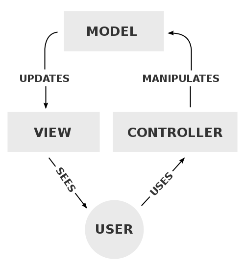

<!-- Google Analytics -->

# Model view controller

## Putting it into practice
Mapping MVC in the real world:
* is messy 
* requires lots of trade-offs
* there is more than one way to do it

# Models - views - controllers

In MVC, most of the application functionality must be built into a model class known as an Application Model. It is the responsibility of the application model to be the mediateor between the true domain objects and the views and their controllers. 
The views, of course, are responsible for displaying the domain data while the controllers handle the raw user gestures that will eventually perform actions on this data.
So the application model tipically has methods to perform menu command actions, push button actions and general validation on the data that it manages. Nearly all of the application logic will reside in the applicatio model classes.

# Models

Models represent knowledge. A model could be a single object or some structure of objects.

There should be a one-to-one correspondence between the model and the represented world as perceived by the owner of the model.

The nodes of a model should therefore represent an identifiable part of the problem. The nodes should be on the same problem level. It is confusing to mix problem-oriented nodes (e.g. a calendar appointment) with implementation detail (e.g. a paragraph).

# Views

A view is a (visual) representation of a model. It would originally highlight certain attributes of the model and supress others. It acts therefore like a _presentation filter_.

A view is attached to its model (or model part) and gets the data necessary for the presentation from the model by asking questions. The view may also update the model by sending appropriate messages. All these questions and messages have to be in the terminology of the model, the view will know the semantics of the attributes of the model it represents. (it may, for example, ask for the model's identifier and expect an instance of Text, it may not assume that the model is of class Text.)

# Controllers 

The browser is responsible for combining and rendering the CSS and HTML into a set of final, manipulatable pixels on the screen. It gathers input from the user and marshals it to any JavaScript code necessary for the page to function. But here, too, we have flexibility: we can plug in a different browser and get comparable results. Some browsers might render it faster, or with more fidelity, or with more bells and whistles.

A controller is the link between a user and the system. It provides the user with input by arranging for relevant views to present themselves in appropriate places on the screen. It provides means for user output by presenting the user with menus or other means of giving commands and data. The controller receives such user output, translates it into the appropriate messages and pass these messages on to one or more of the views. 

A controller should never supplement the views, it should for example never connect the views of nodes by drawing arrows between them. 

Conversely, a view should never know about user input, such as mouse operations and keystrokes. It should always be possible to write a method in a controller that sends messages to views which exactly reproduce any sequence of user commands.

# Editors

A controller is connected to all its views, they are called the parts of the controller. Some views provide a special controller, an editor, that permits the user to modify the information that is presented by the view. Such editors may be spliced into the path between the controller and its view, and will act as an extension of the controller. Once the editing process is completed, the editor is removed from the path and discarded. 
Note that an editor communicates with the user through the metaphors of the connected view, the editor is therefore closely associated with the view. A controller will get hold of an editor by asking the view for it - there is no other appropriate source.
