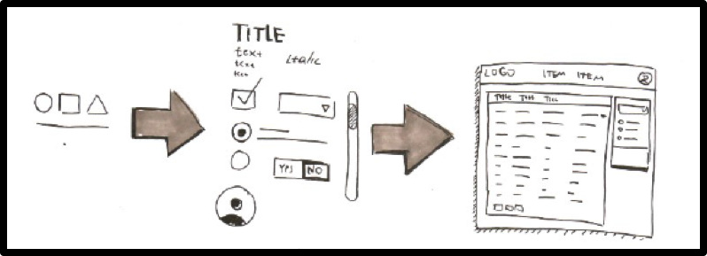
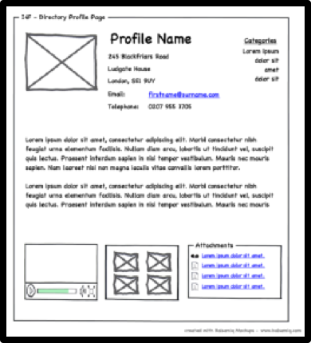
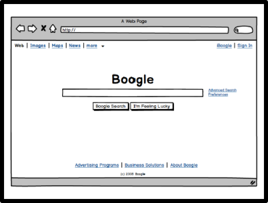
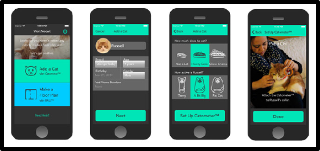

<!-- Google Analytics -->

# User Interface Design

## From requirements to design
* We got the requirements, now what?
* User stories, use cases...
* These are elaborated into scenarios and visual designs ahead of implementation
  * Leaving details out and capturing the rough scope of the app
  * Descriptive vs prescriptive
  * Expose flaws
* Same requirements can end up in different designs

## Different fidility levels
### Sketches

### wireframes

### Mockups

### Prototypes

## Why mock-ups?
* Stimulate a dialogue with a customer
  * Confirm requirements
  * Show different choices
  * Exchange ideas
* Save time
  * Prevent misunderstandings
  * Remove bugs early on
* Tips
  * Extract tasks from requirements
  * Follow a top-bottom approach

## Ben Schneiderman's 8 golden rules

1. _Strive for consistency_
  * Consistent sequences of actions should be required in similar situations; identical terminology should be used in prompts, menus etc. Consistent color, layout, capitalization, fonts and so on, should be employed throughout. Exceptions, such as required confirmation of delete commands or no echoing of passwords, should be comprehensible and limited.
2. _Seek universal usability_
  * Recognise the needs of diverse users for plasticity, facilitating transformation of content. Novice to expert difference, age ranges, international variations, disabilities etc. Adding features for novices (explanations etc.) and features for experts (shortcuts and faster pacing) should enrich the interface design and improve quality.
3. _Offer informative feedback_
  * For every action, there should be interactive feedback. For frequent actions, the response can be modes, for major actions it should be more substantial. Visual representation of the objects of interest should provide an environment for showing changes explicitly.
4. Design dialogues that bring closure
  * Sequences of actions should be organised into groups. Informative feedback at the completion of a group of actions gives the users satisfaction of accomplishment, a sense of relief, a signal to drop contingency plans from their minds, and an indicator to prepare for the next group of actions. Example: E-commerce websites move users from selecting products to the checkout, ending with a clear confirmation page that completes the transaction.
5. Prevent errors
  * As much as possible, design the interface so that users cannot make serious errors. Example: Gray out menu items that are not appropriate, do not allow alphabetic characters in numeric entry fields. If an user makes an error, the interface should offer simple and specific instructions for recovery. For example, users should be guided to repair only the fauly part. The state of the interface should remain unchanged.
6. Permit easy reversal of actions
  * As much as possible, actions should be reversible. This feature relieves anxiety, since users know that errors can be undone, encouraging expolration of unfamiliar options.
7. Keep users in control
  * Experienced users desire the sense that they are in charge of the interface and that it responds to their actions. They do not want surprises or changes in familiar behavior, and they are annoyed by tedious data-entry sequences, difficulty in obtaining info.
8. Reduce short-term memory load
  * Humans' limited capacity for information processing in short-term memory requires that designers avoid interfaces in which users must remember information from one display and then use that information on another display. It means that cellphones should not require reentry of phone numbers, website locations should remain visible, and lengthy forms should be compacted to fit a single display.