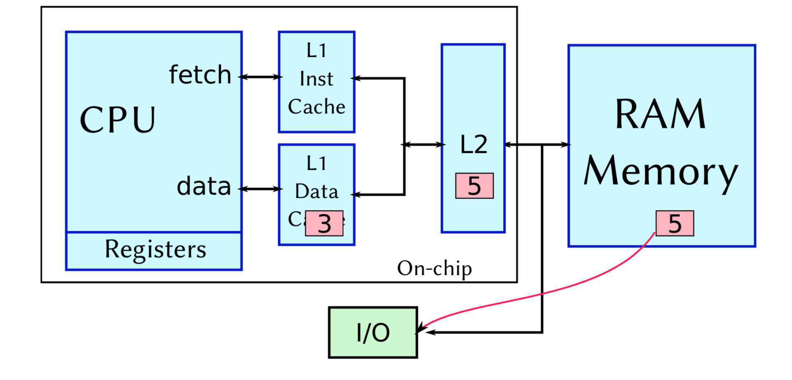

<!-- Google Analytics -->
<script async src="https://www.googletagmanager.com/gtag/js?id=UA-113560131-1"></script>
<script>
  window.dataLayer = window.dataLayer || [];
  function gtag(){dataLayer.push(arguments);}
  gtag('js', new Date());
  gtag('config', 'UA-113560131-1');
</script>

# Caches

# UNDER CONSTRUCTION

## How to build a cache

when CPU does a ```LDR R0 [0x01234567]``` there is a parallel check on the cache 

**Cache hit**: When the CPU requests some memory address and it's found in the cache

#### Temopral locality:

* Things recently used will likely be used again soon
* eg. instructions and data in loops

#### Spacial locality:

* Things close together in store are often used together
* eg. instructions or array elements

**Hit Rate**: Fraction of cache accesses which "hit" in cache

* Hit rates for instructions usually better than for data

**Cache misses**: Temporal locality tells us it's a good idea to cache it

* Put new value in cache (Spacial locality -> maybe store more)
* If cache is full we evict some of it

**LRU** (Least recently used)

* Makes sense
* Expensive to implement (in hardware)
* 

**Round robin** (or cyclic)

* Cycle round locations
* Least recently fetched from memory

**Random**

* Easy to implement
* Not as bad as it might seem


Writes are slightly more complex

* Must do an address comparison first to see if address is in cache
* Cache hit
	* Update value in cache
	* Update in RAM?

Write Through = Every cache write is also done to memory
Write Through with buffers
Copy back = Write to cache, only update to RAM when evicted

**Cache miss on write** 

* Allocate
	* Find a location
	* Assign cache location
	* Write through back to RAM

* Write around (???)

....


Fastest is Write Allocate / Copy Back

But cache & main memory are not "coherent"

Does it matter?

* I/O devices
* Exceptions
* Multi-processors

May need special handling (later)


We want fully associative achce!

* It's expensive
* Need to store full 32 bit addresses
* Hardware comparison is expensive (logic) and uses power

It is possible toacheive small and fast (usually static) RAM
memory in special ways

Few real processor caches are fully associative


### Set associative cache

* A compromise!
* A set associative cache is simply a small number (2 or 4) of direct mapped caches operating in parallel
* If one matches, we have a hit 


# TODO 
`Review of lecture 3 in lecture 4`
* Control bits
	* Valid & Dirty bits

* Locality tradeoffs and compromises
	* Impact of cache line size
	* Spacial vs temporal locality

* Multiple-layer caches
	* Why, how
	* Performance model in a cache hierarchy

### Formula for calculating time to access
* Ti = time to access memory at level i of cache
* hi = hit percentage at level i
* mi = miss percentage at level i

`Ti = hi*ti + mi*(ti + Ti+1)`

## TOC Lecture 4

* "3 x C's" model of cache performance
* Time penalties for starting with empty cache
* Systems interconnect issues with caching and solutions!
* Caching and Virtual Memory

Describing Cache Misses
* Compulsory Misses
	* Cold start
* Capacity Misses
	* Even with full associativity, cache cannot contain all the blocks
of the program
* Conflict Misses
	* Multiple blocks compete for the same set. 
	* This would not happen in fully associative cache

## Possible solutions?
_ | Compulsory misses | Capacity | Conflict
--- | --- | --- | ---
 Hardware | nothing | bigger caches | Increase associativity level <br> Improve replacement policy
 Software | nothing | optimise working set | software optimisations

Today's caches, how long does it take to fill

* L3 cache? (8MB)
* L2 cache? (256KB)
* L1 cache? (32KB)

	* Number of lines = (cache size) / (line sie)
	* Number of lines = 32K/64 = 512
	* 512 x memory access times at 20nS = 10uS
	* 20,000 clock cycles at 2GHz

	

* Problem
	* I/O reads from memory
	* But the cache has a new, updated value

### Cache consistency software solutions

* OS knows where I/O takes place in memory
	* Mark I/O areas as none cacheable

* OS knows when I/O starts and finishes
	* Clear caches before & after I/O

### Cache consistency hardware sollutions
#### ???? (Sol 1)

#### Snooping (Sol 2)
* Snoop logic in the cache
	* Observes every memory cycle 
	* Scalability issues

## Caches and Virtual Addresses

Recap:
 * Use Translation-Lookaside Buffer to translate Virtual to Physical

 * What addresses in cache

 ## Options for caching


