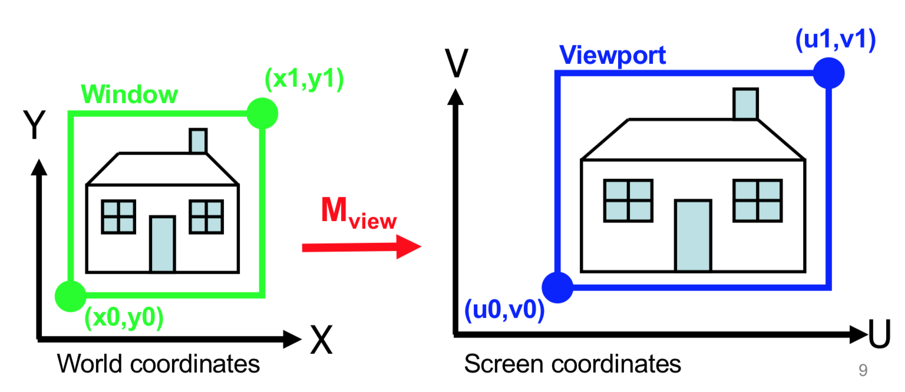
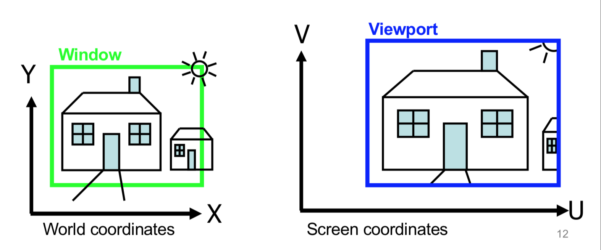
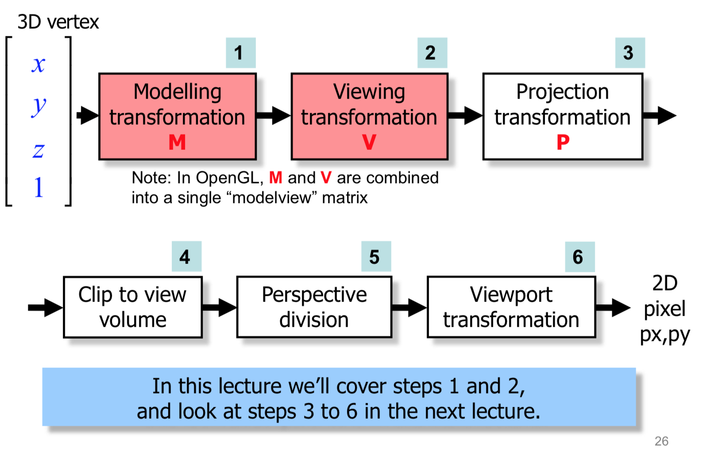
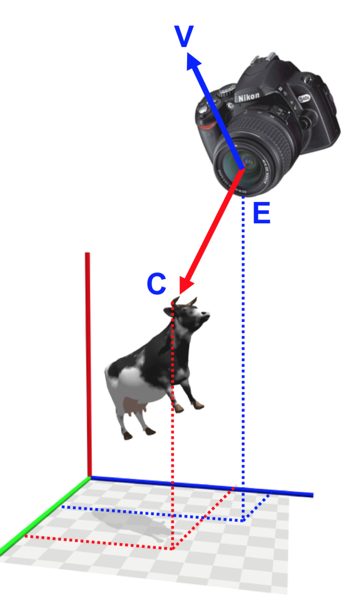
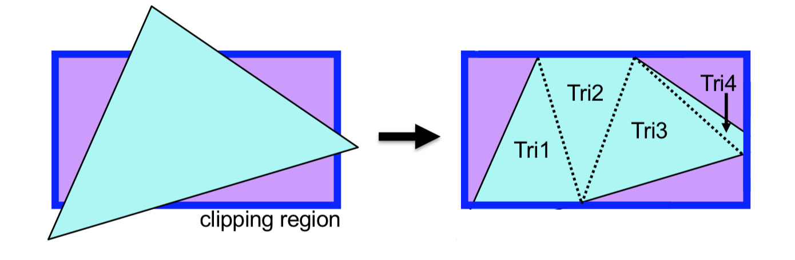

<!-- Google Analytics -->
<script async src="https://www.googletagmanager.com/gtag/js?id=UA-113560131-1"></script>
<script>
  window.dataLayer = window.dataLayer || [];
  function gtag(){dataLayer.push(arguments);}
  gtag('js', new Date());
  gtag('config', 'UA-113560131-1');
</script>

# 3D Viewing

# The camera

* Google Cedar Point for a nice rollercoaster

## Viewing in 2D
How do we specify the mapping from our scene to the display screen?
* We use the **analogy** of photographing the scene with a camera
* In this case the camera is confined to the 2D plane

We can find `Mview` (viewing transformation) easily, in 3 steps 
* M1: Translate by (-x0, -y0) to place the window at the origin 
* M2: Scale the window to be the same shape as the viewport 
* M3: Shift to the viewport position


```
M1: Translate (-x0, -y0)
M2: Scale (u1-u0/x1-x0, v1-v0/y1-y0)
M3: Translate (u0, v0)

Mview = M3 * M2 * M1
Pscreen= Mview * Pworld
```

## Clipping

* Normally we will want to CLIP against the viewport to remove those parts of primitives whose coordinates are
outside the window
* There are standard algorithms for clipping lines and polygons
* It might be useful to have more than one windows and viewports (i.e. in 3D editing apps)



## Viewing in 3D
* In 2D graphics, we view our world by mapping from 2D world coordinates to 2D screen coordinates: easy and obvious
* In 3D graphics, in order to view our 3D world, we have to somehow reduce our 3D information to 2D information, so that it can be displayed on the 2D display: not so easy and obvious
* To specify how those views are created, we again use the analogy of “taking a picture using a camera”, but this time our “camera” is like a real-world camera: It has a position and orientation in 3D space, and a particular type of lens.

## Real world analogy
Real world | In computer terms
--- | ---
Arrange the scene into the desired composition | Set Modelling Transformation
Position and point the camera at the scene | Set Viewing Transformation
Choose a camera lens (wide-angle? zoom?) | Set Projection Transformation
Decide the size of the final photograph | Set Viewport Transformation

## 3D Viewing Pipeline


## Duality of modelling and viewing

Ex: moving the camera by -3 is like moving the object by +3
TODO

## Specifying the "camera"

1. Specify where the "camera" is in 3D space. this is the **eye point**, **E**
2. We specify a **centre of interest C**, a 3D point which the camera is looking at
3. We specify the up **direction** of the **camera**, using a **view up vector V** 
4. We can then use E,C and V to derive a transformation which, when applied to the model, would give the same view as if we really used this **camera**



## Defining the camera coordinate system

# TODO


# Projections

## Planar Geometric Projections
* Doesn't distort lines
* Others do (see cartography)

### Parallel projection

* The projection is a set of points at chich the projectors intersect the projection plane
* Parallel edges remain parallel in the projection. Angles between edges may be distorted.

### Ortographic parallel projection
* Projectors are **perpendicular** to the projection plane
* The projection plane is **parallel** to a plante (Xy, Xy, Xz) of the world

### Axonometric parallel projection
* In axonometric projection, projectors are **perpendicular** to the projection plane
* The projection plane can have **any orientation**
* Now we can see the 3 axes. Distortion of lengths or angles, but measurements can still be made

### Oblique parallel projection
* Most general case
* Projector can make **any angle** with the projection plane
* Projection plane can have **any orientation** relative to the object being viewed

### Removing hidden surfaces
A projection is by definition "flattened" ou
Solution: Projection normalization
* We need a perspective transformation which preserves depth information.
* Suppose we have a particular perspective transformation expressed by frustum F and matrix M
* It can be shown that we can derive a new transformation matrix PN, based on M, that distorts F into a cube
* Transforming our model by PN, and then taking an orthographic projection produces exactly the same result as performing our original perspective transformation M, with one difference: the z depth values are preserved
* This new technique is called projection normalization, and OpenGL creates PN for us automatically.

### Clipping 
Clipping takes place in the cube produced by projection normalization (easier than clipping against a frustum)




Check out [Julian Beever](http://julianbeever.net)