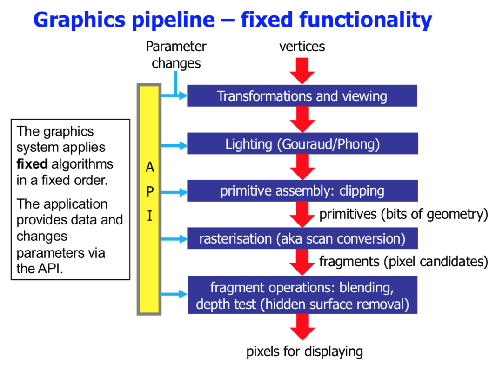
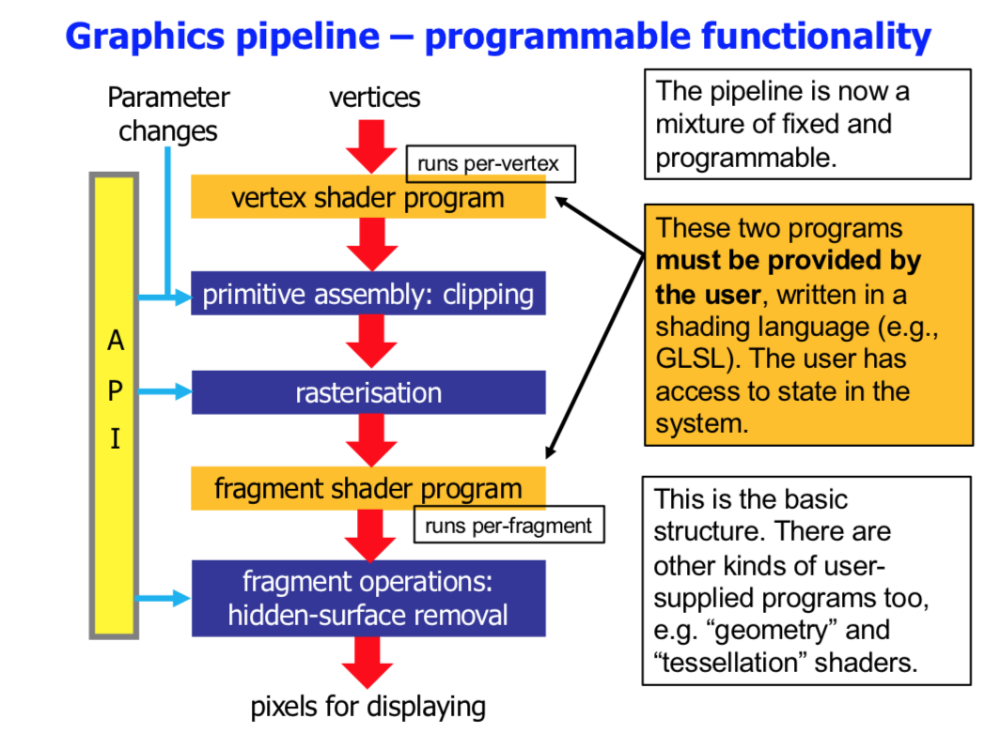

Computer Graphics
===
---
1. Lectures are podcasted
2. Materials on **Blackboard**
3. Weekly self assessment quizes on Blackboard
5. Labs: (Week A) [20% of mark]
6. Coursework: 5 x 1 hour (week B) [5% of mark]
7. Exam 2 hours online, 20MCQ and [75% of mark]

*Fixed pipeline OpenGL* = ?  

**Labs**

- One lab every 2 weeks  
- Begin 12 February (week 3A)  
- 4 exercises, skeleton C code  
- Can use C/C++/ObjC (**Thank God**)  
- Pp OpenGL / WebGL not recommended (probably no TA help)  

**Lab 1 (1 session)**  
3D graphics: Transformation and viewing

- Skeleton program has a temple with a rotating teapot in it  
- You get the code with no animations  
- You have to move the camera to look around and move in the world  

**Lab 2 (2 sessions)**  
Build an orrery (solar system simulation?)

- Implement trigonometry to have planets move around
- Provide multiple camera views

**lab 3 (1 session)** &&
**lab 4 (1 session)**  
Both about image processing

**Coursework**  
Every 2 weeks alternating with labs
Begin 5 February
On BB
Not more than 45 mins each

1. CW1: Intro to OpenGL
2. CW2: 3D modelling in AC3D
3. CW3: Light and texture
4. CW4: 
5. Cw5: Region based processing??

*Todo: Read BB webpage, Go through the basic tutorials in the Reference Manual, start CW12*

## Introducing image synthesis

### Raster graphics

* 2D array of pixels(screens) or dots(printers)
* images must be sampled
* Will **always** be an approximation
* Apple Lisa: 720x360 pixels screen

### OpenGL

* Open Graphics Library
* Language independent
* First released in 92
* Fits between Application program and display/input device
* C, C++, C#, Swift, Java, JavaScript, Python, etc...
* Language agnostic, device agnostic

### Pipeline

* con: new algorithms and techniques can’t be added
* con: it’s deprecated!
* pro: it’s simple to use and fine for many purposes

* pro: provides huge flexibility
* pro: it’s the state-of-the-art, cutting edge
* con: for the beginner there is significant start-up cost

