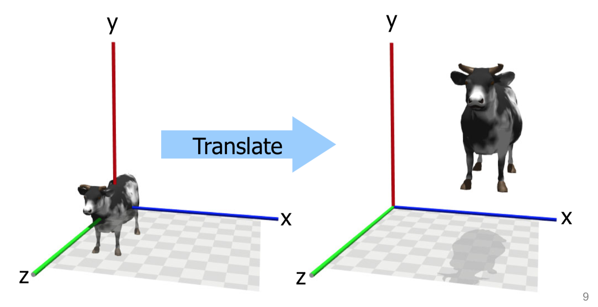
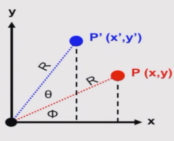
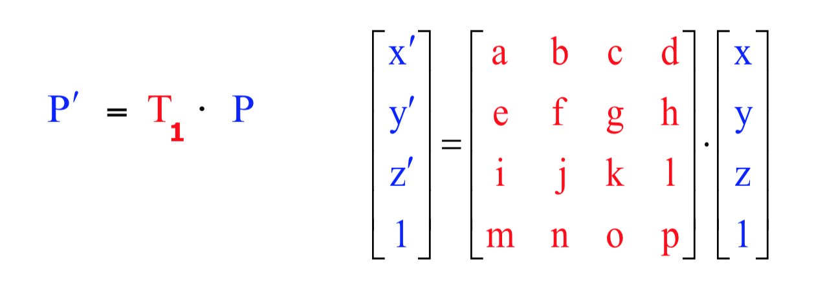

<!-- Google Analytics -->
<script async src="https://www.googletagmanager.com/gtag/js?id=UA-113560131-1"></script>
<script>
  window.dataLayer = window.dataLayer || [];
  function gtag(){dataLayer.push(arguments);}
  gtag('js', new Date());
  gtag('config', 'UA-113560131-1');
</script>

# Transformations

## Table of Contents?
* [Vector and matrix representations](#vectors-and-coordinates)
* [Geometrical transformations](#geometrical-transformations)
* Homogenous coordinates
* Using transformations in OpenGL
* Some handy vector geometry

## Vectors and coordinates
* Both coordinates and vectors can be represented by a triple of X, Y, Z values.
* In computer graphics we usually write these in column format. OpenGL uses **column** vectors. Some use rows, like Matlab (WRONG).

### Cartesian Coordonates

**Rene Descartes** 1595-1650 was the inventor of the cartesian coordinates

* A coordinate represents a **point** in space, measured with respect to an **origin** and set of X, Y, Z **axes**

### Vectors
* A vector is a **direction** in space with respect of X, Y, Z axes
* It has characteristic length
* A vector of length 1 is known as a "unit vector"

##  Geometrical transformations
* Define geometry as sets of vertices
* Apply transformations to vertices to change them
* Examples: translation, scaling, rotation
* To transform a whole shape, we transform all its vertices

### Translation

* Applies a 3D shift (tx, ty, tz) to all coordinates 
```
x' = x + tx
y' = y + ty
z' = z + tz
```

### Scaling 

* Applies a 3D scale (sx, sy, sz) to all coordinates
(with respect to the origin
```
x' = x . sx
y' = y . sy
z' = z . sz
```

### Rotations

#### 2D Rotations

```
x = Rcosϕ
y = Rsinϕ
x' = Rcos(ϕ + Θ)
  x' = RcosϕcosΘ - RsinϕsinΘ
y' = Rsin(ϕ + Θ)
  y' = RcosϕsinΘ - RsinϕcosΘ
```
Substituting for Rcosϕ and Rsinϕ gives:
```
x'= xcosΘ - ysinΘ
y'= xsinΘ + ycosΘ
```
This works only if you rotate with respect to the origin.
If you want to rotate by another point Q(qx, qy):
* Translate by (-qx, -qy)
* Do the rotation by the angle Θ
* Translate back by (+qx, +qy)

#### 3D Rotations
* Rotations about one of the axes (for example Z):
```
x'= xcosΘ - ysinΘ
y'= xsinΘ + ycosΘ
z' = z (no change)
```
* Rotations about an **arbitrary** axis vector A
  * Is analogous to 2D rotations about an arbitrary point
  * The approach is a sequence of steps:
    1. Shift the vector A until it passes through the origin (M1) -> A1
    2. Rotate A1 about X axis until it lies in XY plane (M2) -> A2
    3. Rotate A2 About Z until it is coincident with X axis (M3) -> A3
    4. Perform the rotation about X axis by Θ (M4) -> A4
    5. Apply M3^-1 to A4
    6. Apply M2^-1
    7. Apply M1^-1

  * Full tansformation is ```P' = M1^-1 * M2^-1 * M3^-1 * M4 * M3 * M2 * M1 * P``` 

## Representing transformations
We've seen three kinds of transformations so far:
* Translations
* Scaling
* Rotations

They're all different, so it would be convenient to have a **homogenous** representation:
* 4 by 4 matrixes
* After the multiplication, the **homogenous coordinates** become (x, y, z, w)
* w is in the 4th spatial dimension (Really!)
* Usually ```w = 1``` so we just ignore it
* When it's not, we need to "normalise" it

The transformation T1 changes point P to P'


## Composite transformations
Transformations can be combined and then apply the **composite** to the original point.
```
P' = T1 * P
P" = T2 * P'

P" = T2 * T1 * P
```
We can get the **composite** by first multiplying T1 and T2 together first and applying it to P at the end
```
Tc = T1 * T2

P" = Tc * P
```
* Play with ```/opt/info/courses/OpenGL/lectureExamples/transformation4```

### Non-commutativity, or "order matters"
* Matrix multiplications (and therefore transformations) are not commutative
* Therefore order of transformations matters

Example: Scaling an object about an arbitrary point P
* M1: Translate to origin
* M2: Scale about the origin
* M3: Translate back

Composite transformation is ```M3*M2*M1```

### Non-invertible transformations
Scaling by
```
1 0 0 0
0 0 0 0
0 0 1 0
0 0 0 1
```
"flattens" the object
* Operation cannot be reversed
* i.e. there is no T^-1 for this T


## Transformations in OpenGL (1)
* OpenGL maintains two transformation matrices internally:
  * the  **modelview**  matrix, used for transforming the geometry you draw, and specifying the camera
  * the **projection** matrix, used for controlling the way the camera image is projected onto the screen (see later)
* Every 3D point you ask OpenGL to draw is automatically transformed by these two matrices before it is drawn (and you cannot prevent this happening)
  * Pdrawn = ProjectionMatrix x ModelviewMatrix x Pspecifed
* For full details, see Chapter 5 of the OpenGL manual.

OpenGL provides functions for easily dealing with transformations. Here are some:
```c
glTranslatef(tx, ty, tz)
glScalef(sx, sy, sz)
glRotatef(theta, rx, ry, rz)
```
* When we call one of these functions, OpenGL creates a corresponding temporary matrix TMP, and then multiples the modelview matrix by TMP, and then throws away TMP

Example (rotate and then shift the teapot):

```c
glMatrixMode(GL_MODELVIEW);
glLoadIdentity(); // M= identity matrix (I)
glTranslatef(tx, ty, tz);
// OpenGL computes temp translation matrix T,
// then sets M= M x T, so now M is T
glRotatef(theta, 0.0, 1.0, 0.0);
// OpenGL computes temp rotation matrix R,
// then sets M= M x R, so M is now T x R
glutWireTeapot(1.0);
```
Notice the order we call the functions in... it’s the reverse of how we would write it down logically.
