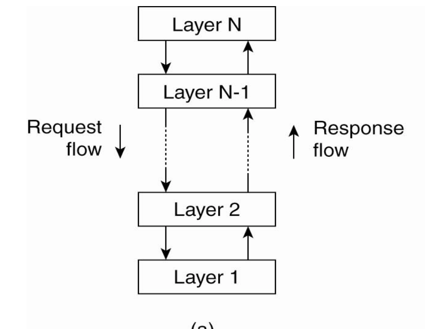
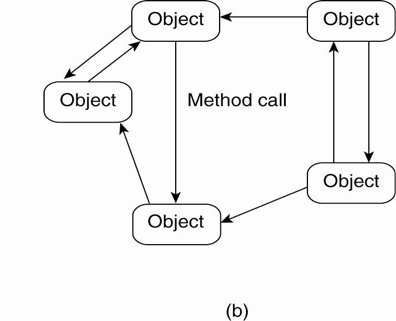
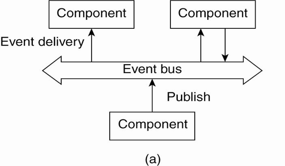
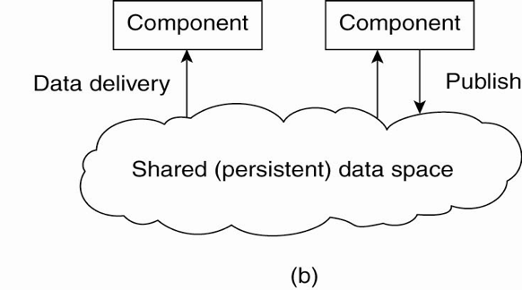
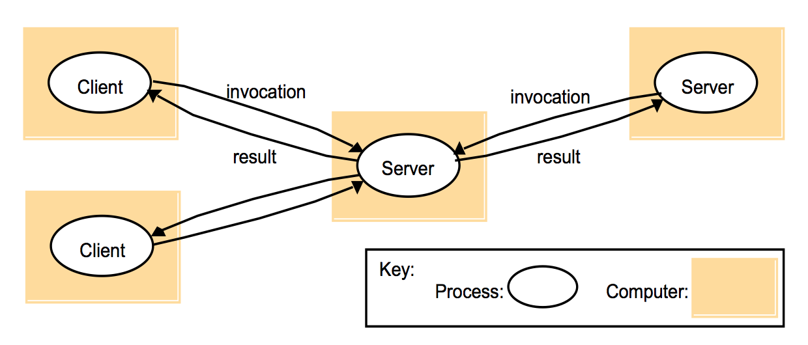
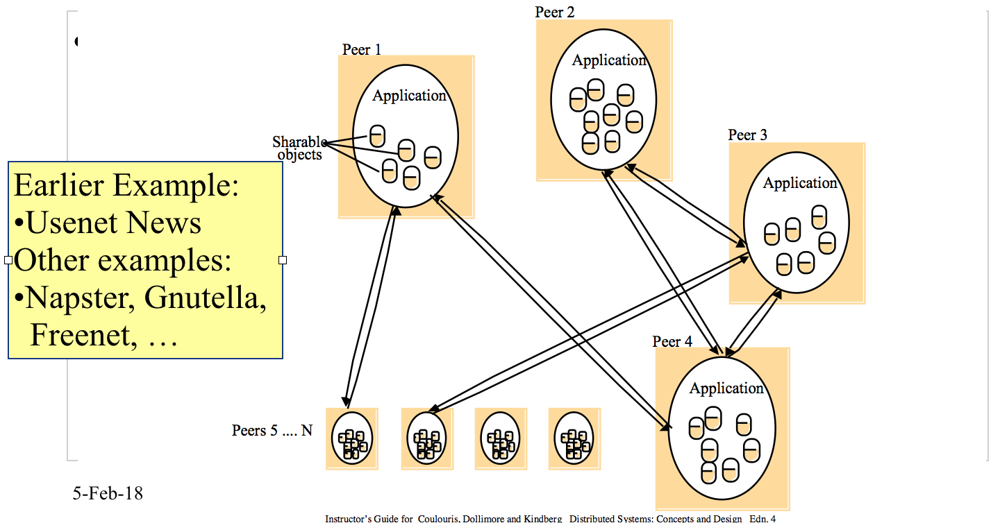

<!-- Google Analytics -->

## Architecture of Distributed Systems

### Tightly coupled
* Highly integrated machines
* Look like a single computer

### Loosely coulpled (share nothing)
* Client-server
* Peer-to-Peer
* A key differentiation based on the Programming Interface:
    * Distributed Objects
    * Web Services
    * Read [Web Services are not Distributed Objects](http://www.allthingsdistributed.com/historical/archives/000343.html)

## Tightly coupled systems

* **Distributed shared memory** (DSM) provides the illusion of a single shared memory. Programmer doesn't care about message passing.

### Issues with DSM
* Machines are still connected by a network
    * Dependent on network traffic
    * Reduce the latency between request and completion
* Keeping track of the location of shared data
* Overcoming delays when accessing remote data
* How to make shared data concurrently accessible
* Replication of shared data on multiple machines:
* The need memory coherence

_See * Chapter 18 in Coulouris et al book._

## Architectural Styles

### Layered architecture
When there is a request, it goes from a top layer to the layer below and so on.

### Object based Architecture

### Event Based Architecture

* Real life equivalent is a notice board
###### Listen to the lecture, min 27ish

## Shared Data Space Architecture

## Midleware
* A software layer taht provides an abstraction to mask heterogeneity of the underlaying platforms

## Client-Server Model

* Widely used
* Functional Specialisation
* Asymmetrical
* Centralised
* Tends to scale poorly

### Server
* Passive (slave)
* Waits for requests
* Upon receiving a request, it processes it and sends reply
* Can be:
    * Stateless (does not keep information)
    * Stateful (keeps state between requests)

### Client
* Active (master)
* Sends requests
* Waits for and receives server replies

## Peer-to-Peer Model
* Symmetrical, computers have the same "rights"
* Truly Distributed
* Share / exploit resources with large number of participants
* Resource discovery is a challenge

### Proxies
* Can be used to route clients to servers
* Can cache data and provide faster access

### Mobile Code
* A server sends the client the applet code
* Client interacts with the applet

### Thin clients
* When computers were expensive, _thin clients_ were used only to access data
* All computation was done on servers
