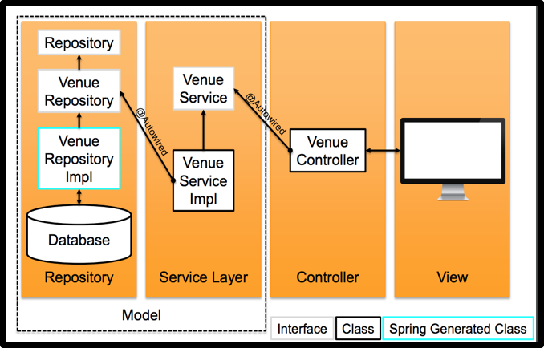

<!-- Google Analytics -->
<script async src="https://www.googletagmanager.com/gtag/js?id=UA-113560131-1"></script>
<script>
  window.dataLayer = window.dataLayer || [];
  function gtag(){dataLayer.push(arguments);}
  gtag('js', new Date());
  gtag('config', 'UA-113560131-1');
</script>

# Data Modelling

## Model? Entry?
* In Java Spring terminology, 'model' and 'entity' are used interchangeably
* We model data, but springs calls those 'entities' because they are entities in the database
* Spring calls the data passed to a view a 'model'.
* Spring uses MVC: Think of the model as being made up of a set of entities and DAO (Data Access Objects)

## Modelling data with POJOs
POJO (Plain Old Java Objects) are normal Java object classes (not JavaBean, EntityBean etc.) and do not serve any special role.

## Annotate POJOs for persistance
```java
@Entity
@Table(name = "venues")
public class Venue {
  private long id;
  
  private String name;

  private int capacity;

  public Venue() {

  }

  // Getters and setters omitted for brevity
}
```

* We annotate them with `@Entity` which invokes Spring magic:
  * Creates a table in the database
  * Creates columns for each field
* `@Table` can be used to give a human-readable name to the table
* These are class-level annotations

## More persistence hints
* Annotate your primary key field with
  * `@Id` - to mark it as unique ID
  * `@GeneratedValue` - to generate outomatically at save
* Use `@Temporal` to mark up dates and times: `@Temporal(TemporalType.TIME|DATE|TIMESTAMP)`

## Data relationships
* `@OneToMany` - 'A venue can host many events'
* `@ManyToOne` - 'An event has one venue'
* `@OneToOne` - 'A venue has a manager'

Spring does a lot of config behind the scenes
  * Heavy use of annotations

Many core class types do not have constructors
  * `@Controller`
  * `@Service`
  * `@Configuration`

You don't initialize an instance variable!
  * Most things are passed in to methods directly
  * Annotate certain things with `@Autowired`
  * Spring with initialize them for you

## Data Access Architecture


## Spring repositories

```java
public interface VenueRepository extends CrudRepository<Venue, Long> {
  public Iterable<Venue> findAllByName(String name);
  public Iterable<Venue> findAllByNameOrderByNameAsc(String name);
  public Venue findFirstByNameOrderByNameAsc(String name);

  public Venue findByNameContainingAndCapacity(String nameSearch, int capacity);

  public Iterable<Venue> findAllByCapacityBetween(int min, int max);
  
}
```

* Spring provides repository implementations
  * CRUD: Create, Read, Update, Delete
* A 'maker' interface
  * Spring magic creates concrete implementation
* Provides
  * count()
  * findOne(long id), findAll()
  * save(Venue venue), delete(long id)

## Querying data via a Service interface
```java
@Service
public class VenueServiceImpl implements VenueService {
  @Autowired
  private VenueRepository venueRepository;

  @Override
  public Iterable<Venue> findAll() {
    return venueRepository.findAll();
  }
}
```

* Create a Service interface to expose the methods you need and get Spring to auto-wire the repo
* A lot of methods in a service will call straight through
* Some will do extra processing

## More Spring magic
* Spring has a mechanism to convert method names into queries
* Simply define the queries you want as methods in your repo interface