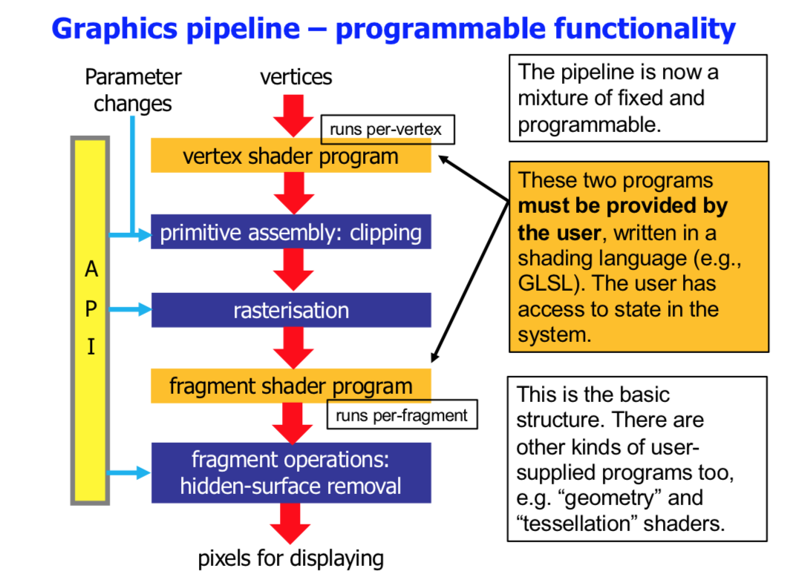

<!-- Google Analytics -->

# Introduction

### Random facts about pixels
* On a 23" screen at 1280x1024 a pixel is about 0.2mm.

* The number of pixels in a movie:
    * Consider a movie frame 4K x 4K pxels
    * At 24 frames/sec (standard for movies)
    * Movie is 90 min
    Total: about **1,000,000,000,000** ($10^{12}$) pixels

## How did we get here?

### CRT Vector displays
* Eleectorn beam draws lines and text as instructed
* Image fades out immediately
* Must be redrawn at a refresh of at least 15-20 fps to have a "static" image

## Raster graphics displays
* 2D array of pixels(screens) or dots(printers)
* images must be sampled
* Will **always** be an approximation

### History
* Henri Gouraud invents shading (1970)    
* First GUI - Xerox Alto, Xerox Park 1973
    * 606 x 808 pixels
    * 6MHz CPU, 96-256kB RAM
    * \$12,000-\$40,000
* First commercially available GUI - Apple Lisa
    * 720 x 360 pixels
    * 5MHz CPU, 1-2MB RAM
    * \$9,995
### OpenGL

* Open Graphics Library
* Platform/Language independent
* First released in 92
* Fits between Applications and Display/Input Devices
* C, C++, C#, Swift, Java, JavaScript, Python, etc...
* Language agnostic, device agnostic
* [OpenGL.org](http://www.opengl.org)

### OpenGL API
* OpenGL is a specification of an API
* Set of functions for doing 3D Computer Graphics
* Used in industry, engineering, CAD, games, research, etc

## Types of pipeline

* con: new algorithms and techniques can’t be added
* con: it’s deprecated!
* pro: it’s simple to use and fine for many purposes

* pro: provides huge flexibility
* pro: it’s the state-of-the-art, cutting edge
* con: for the beginner there is significant start-up cost

## GLUT
* GL Utility Toolkit (GLUT)
* OpenGL does not handle interaction devices, GLUT does
* Interaction
    * interaction with mouse and keyboard
    * simple menu system
* Primitives
    * Sphere, torus, cone, cube
    * Tetra|Octo|Dodeca|Icosa hedron
    * Teapot
* [Command reference](#Link-to-PDF-on-BlackBoard)

## GLU
* GL Utility Library (GLU)
* Provides functions which "wrap up" OpenGL graphics
    * Curves, surfaces, discs, cylinders
* Utility functions
    * Viewing
    * Textures
    * Tessellation
* [Command reference](http://www.opengl.org/sdk/docs/man)

## Main features of OpenGL

* 3d Graphics (points, lines, polygons)
* Coordinate transformations
* Camera for viewing
* Hidden surface removal
* Lighting and shading
* Texturing
* Pixel (image) operations
