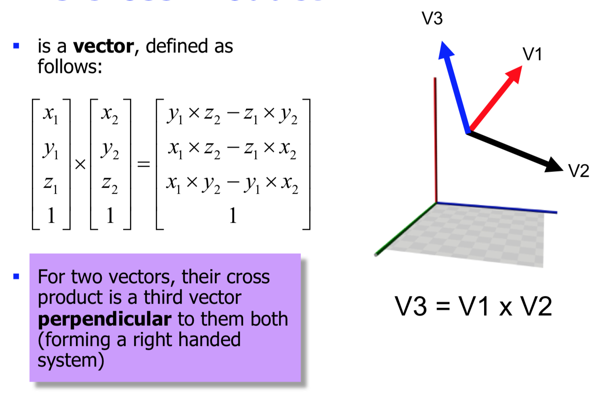
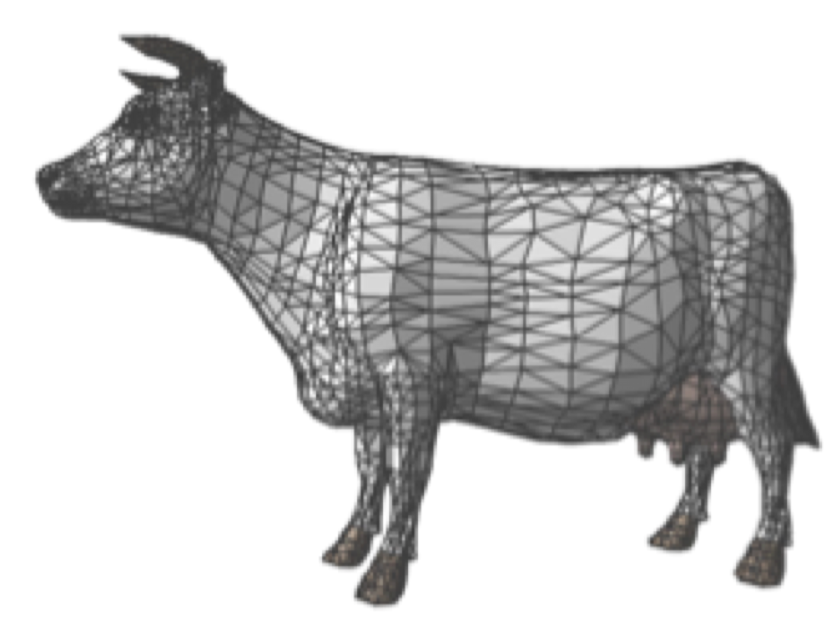
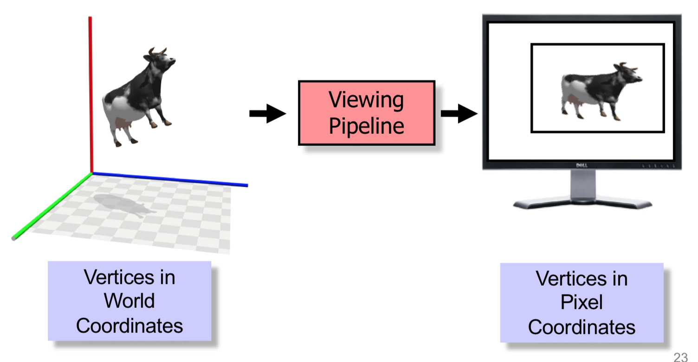
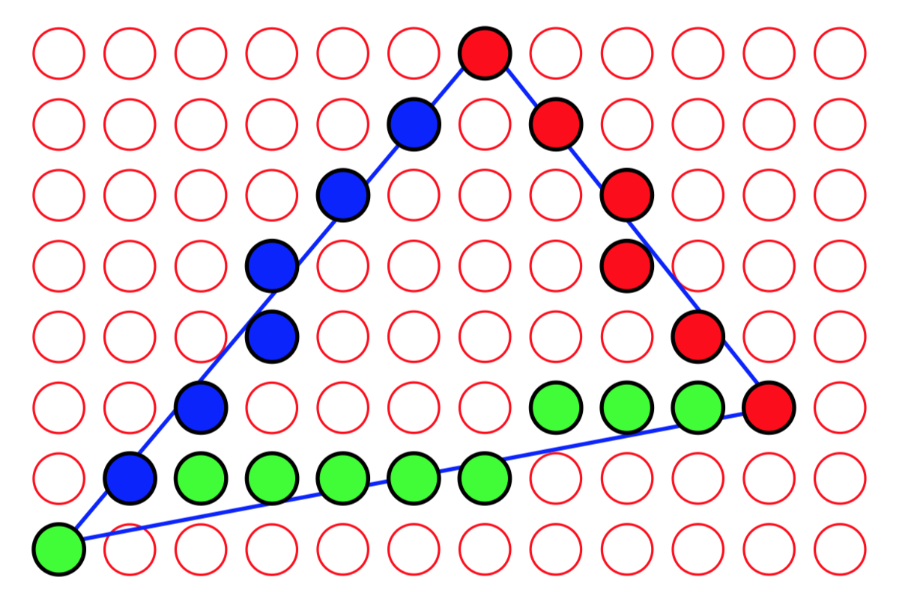
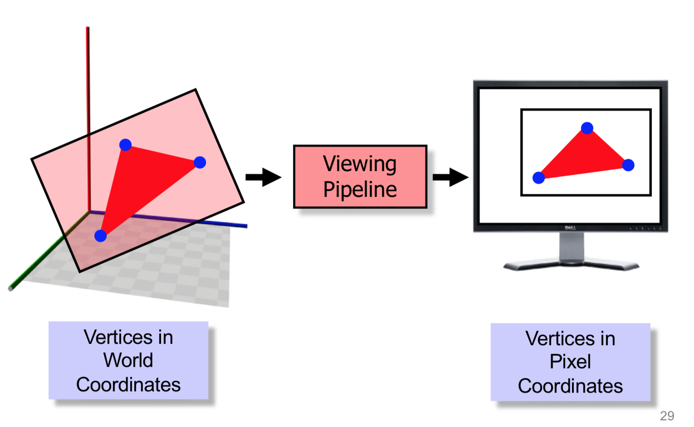
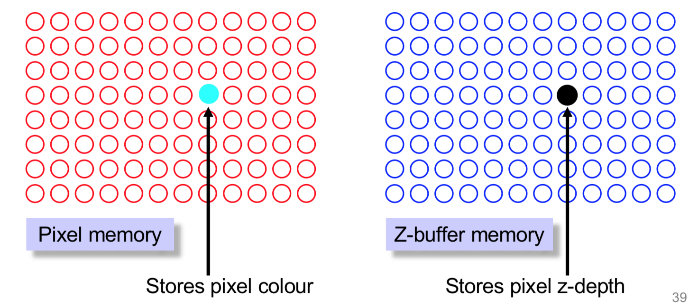

<!-- Google Analytics -->
<script async src="https://www.googletagmanager.com/gtag/js?id=UA-113560131-1"></script>
<script>
  window.dataLayer = window.dataLayer || [];
  function gtag(){dataLayer.push(arguments);}
  gtag('js', new Date());
  gtag('config', 'UA-113560131-1');
</script>
## Polygons

## What is a poligon
* Ordered set of verteces (V1, ..., Vn)

OpenGL polygons are convex
* Convex = all interior angles < 180°

## Tesselation
* GLU Provides functions to tesselate polygons
    * Before: Concave polygon
    * After: Set of **convex** polygons 

## Polygon attributes

* The **surface normal** is a vector perpendicular to the plane of the polygon
* (We use this to distinguish front from back)
* Also to describe it's **orientation** in 3d space
* Orientation is essential in
    * Lighting calculations
    * Collisions
    * Culling

## The cross product
* Is a **vector** define as follows:



## Finding the surface normal

1. Choose a pair of sequential edges E1 and E2, compute their vectors
2. Invert the direction of the first so they now emanate from their shared vertex
3. Their cross product is the surface normal
`N = E2 x -E1`
4. We then almost always normalize N (make its length 1)

## Representing things with polygons

* **Polygon soup** = Huge list of individual polygons, colored individually, drawn in order

* Huge waste of storage space... most models contain “surfaces” not individual polygons, so we could share vertices rather than replicate them per polygon
* Complete loss of semantics: 
    * Does a polygon belong to a cow... or a table...?
* Leads to ‘brute force’ rendering, and makes interaction with the model complex

## Polygon meshes
* Use linked groups of polygons, or meshes, to represent surfaces
* Retains semantics of “surface” but reduces storage by sharing vertices and edges
* Helps with structuring the model so we can manipulate it more easily


18k (polygon soup) reduced to 6k (polygon mesh)

## Meshes

### Triangle strips
### Triangle fans
### Quadrilateral strips
### Quadrilateral mesh

## From Model to display
* We model in a 3D space, then take a view using a “camera” to create a 2D screen image



## Scan conversion

### Scan-converting a line
* We sample the true geometry of the line, and approximate it using the nearest pixels available.



## Bresenham’s algorithm
* `y = mx + c`
* As we move horizontally x changes by 1 pixel
* So `Yn+1 = Yn + m`
* Round yn+1 to the nearest pixel
* Need to swap x and y according to gradient of the line
    * Bresenham (1965) developed a fast algorithm using only integer arithmetic
    * Still in use today

### Scan-converting a polygon


????


## Hidden surface removal
* Viewing the world from a particular viewpoint, which parts of the world can we see, and which parts can we not see, because other objects (partially) block them?
* There are two fundamentally different approaches that we can take to solving this problem:
* We can solve it in **world space**. We can try to work it out geometrically in 3D, and then draw the result. This was the first approach used, 1960-1980s, and it is extremely hard
* We can do it in **display space**. During scan-conversion, whenever we generate a pixel **P**, we determine whether some **other** 3D object, nearer to the eye, **also** maps to **P**. This is now the standard approach.

## The Z-buffer (aka depth-buffer)


* For every pixel in the display memory, there is a corresponding entry in the Z-buffer
* The Z-buffer is used to keep a record of the z-value of each pixel


### Z-buffer algorithm
1. Initialise each pixel to desired background colour
2. Initialise each Z-buffer entry to MAXDEPTH (biggest possible number)
3. For each pixel P generated during scan-conversion of an object:
```
IFz-coordinateofP<Z-BUFFER[P]THEN
    // i.e., the part of the 3D object that mapped to P
    // is nearer to the eye than any other part of the world
    // that has so far mapped to P
    Compute colour of P // lighting, texture... later in the course
    Store colour in P
    Store (i.e., update) z-coordinate of P in Z-BUFFER[P]
ELSE
    // something else has already mapped to P and is nearer to us // so don’t change P
```

### Z-buffer fighting
* Lack of precision in the Z-buffer leads to incorrect rendering of pixels with similar z- values
* Especially horrible when animated
* Solution: `glPolygonOffset()`

## File formatss
* Meshes are often big
* Many different file formats
* The example here is a Wavefront “obj” file:
* 2953 vertices

```
## Three-D Library generated .obj file
## data/womanheadH
##
v 0.698214 -0.204674 2.690314
v 0.685697 -0.198298 2.709758
v 0.715357 -0.148323 2.717670
v 0.716248 -0.176445 2.695745
v 0.666189 -0.129036 2.739556
v 0.704262 -0.140100 2.727099
v 0.674602 -0.190075 2.719187
v 0.655446 -0.197328 2.735766
v 0.791905 -0.143497 2.688993
```