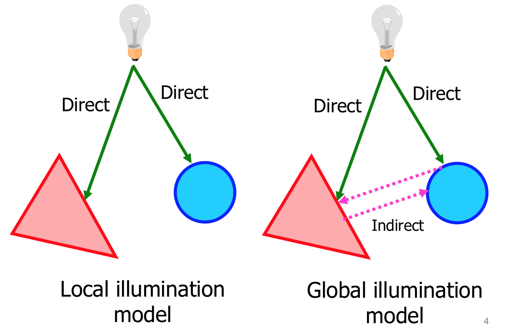
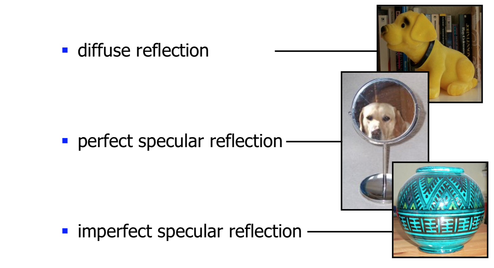
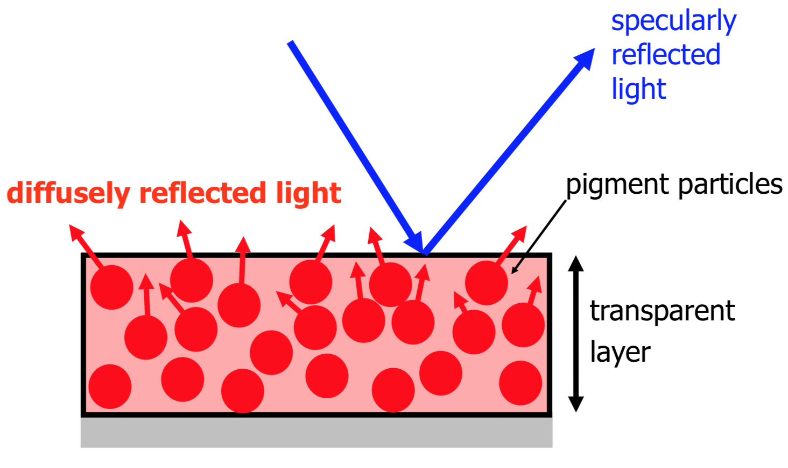
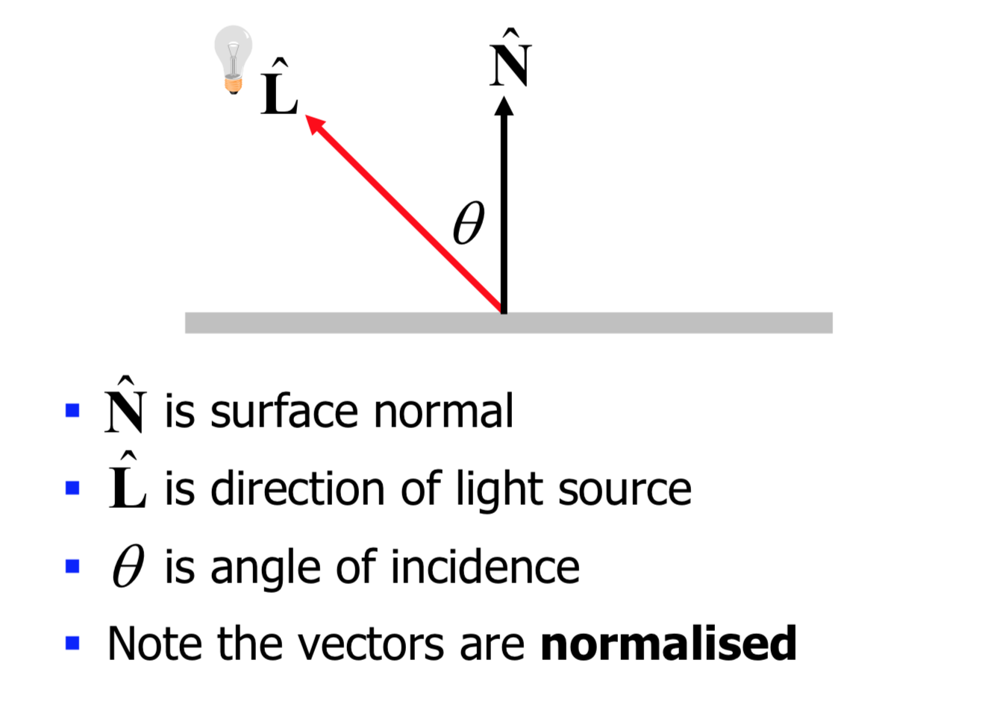

<!-- Google Analytics -->
<script async src="https://www.googletagmanager.com/gtag/js?id=UA-113560131-1"></script>
<script>
  window.dataLayer = window.dataLayer || [];
  function gtag(){dataLayer.push(arguments);}
  gtag('js', new Date());
  gtag('config', 'UA-113560131-1');
</script>

## Rendering

## Local vs Global illumination


* Locally: we treat each object in a scene separately from any other object
* Globally: we treat all objects together, and model the interactions between objects

### Illumination models
* The interaction of light and matter is an extremely complex process
* In computer graphics we try to model this process.
* In other words, we approximate it (to various degrees of fidelity)

## Reflectivity
* There are three classes of reflection


## Light/surface interaction


* The more regular the surface, the smaller range of angles of reflections (mirror like) 

## Types of illumination

* Ambient illumination
  * Each object is uniformly illuminated
  * Objects look 2D
  * Varying the intensity of light `Ia` you increase the brightness
* Point illumination source at infinity (directional illumination)
* Point illumination source in the scene

## Directional lighting


## Local illumination model
```
V1: I = ambient + diffuse
V2: I = KaIa + IpKd * (N^ * L^)
V3: I = KaIa + (Ip/d')Kd * (N^ * L^)
```

