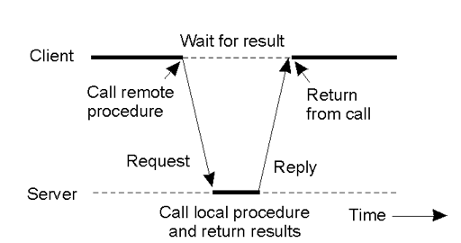
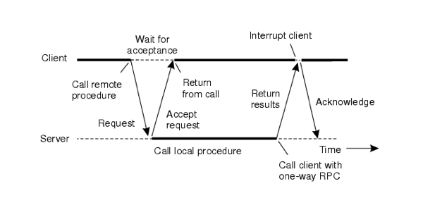
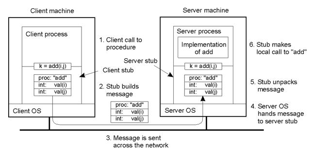

<!-- Google Analytics -->
<script async src="https://www.googletagmanager.com/gtag/js?id=UA-113560131-1"></script>
<script>
  window.dataLayer = window.dataLayer || [];
  function gtag(){dataLayer.push(arguments);}
  gtag('js', new Date());
  gtag('config', 'UA-113560131-1');
</script>

# Remote Procedure Calls

* Simple Distributed Systems can be built using messages with **send** and **receive**

Remote Procedure Call (1984 – Birrell & Nelson) provides a **higher-level** alternative.

* It provides access transparency, i.e. the use of a local service (e.g. provided by the OS) has the same form as use of a non-local one.
* So a process on the client “calls” a process on the server to execute the code of the procedure (providing some service)
* Arguments are sent in the message to the server
* The result is sent in the reply from the server to the client

## Synchronous RPC
* Good for atomic transactions
* e.g. bank transfers


## Asynchronous RPC
* Good for parallel computation



For RPC, client and server are different computers
* Cannot use addresses!
* Value parameters are OK
* Caller and callee need to agree on the format of messages!

### Stubs
Instead of the code to provide the service, the client machine has a stub procedure
* It puts the arguments in a message 
* Sends that message to the server
* Waits for the reply message
* Unpacks the result
* Returns to the application call

## RPC Protocol

7. add executes and returns answer to server stub
8. server stub composes reply message containing this answer
9. message is sent across the network
11. client stub unpacks and returns result
10. client OS passes reply to client stub

### Parameter Marshalling
Packing parameters into a message is known as parameter marshalling
The inverse operation is unmarshalling
These operations need to take into account problems associated with having different machines and different languages in use in the network
* Example big endian vs little endian

#### Endian (big vs. little)
There is more than one way to store the value `2018`
```
x        [2]             [8]    
x+1      [0]             [1]
x+2      [1]             [0]
x+3      [8]             [2]
      big endian    little endian
```
### Generating stubs
* The code for the stubs can be generated once the specification of the procedure is known.
* This should ideally be done in a language independent way – so that the remote service is available to many languages
    * Interface Definition Language (IDL)
        * CORBA (Common Object Request Broker Architecture)
        * Sun (noted for NFS)
        * DCE (Distributed Computing Environment) 

Example
```
// Example – CORBA IDL
// In file Person.idl
struct Person {
	string name; 
	string place;
	long year;
} ;
interface PersonList {
	readonly attribute string listname;
	void addPerson(in Person p) ;
	void getPerson(in string name, 
			out Person p);
	long number();
};
```
## Java RMI
* Java includes RMI in its API
* Marshalling is simpler: Java <=> Java
* It requires that objects sent as arguments or results be **serializable**, i.e. there is a standard external form for them. This allows arbitrarily complex structures (not possible with copy/restore parameters)

A major difference between RMI and RPC is that RMI has references to remote objects!

* In the lab, **RemoteServer** is an interface used to declare **stub** which is such a thing
* The interface lists the methods which can be invoked on it
What are Remote Object References?
    * (CDK 4.3.4) They must be 
    * system-wide
    * not reused for other objects

## Implementing RMI
* As with RPC, the client has a stub (called here a proxy) for each remote class instance – to marshal arguments to, and unmarshal results from, method calls
* This communicates with the dispatcher for the class, which forwards to the skeleton which implements unmarshalling etc.


## Rmregistry
* This is how a server makes a remote object available to clients
* A string is bound to the remote object, and the clients interrogate the registry using the string
* The client must know the server machine name and the port the registry is on (there is a default) 

###### Reading
* Coulouris (ed. 4 or 5): Chapter 5 (but see Chapter 4 for “marshalling”);
* Tanenbaum: Section 4.2 (see 10.3.4 for RMI)


## Passing Parameters
* In a language, such as C, procedure call parameters can be **call-by-value** (modifications by the procedure are valid only within a procedure) or **call-by-reference** (a pointer is passed and modifications affect the memory location).
* Call by **copy/restore** can be used in RPC to replace call-by-reference. E.g.:
    * Client stub copies contents of a pointer to an array of characters to a message (assumes knowledge of size of the array)
    * Message sent to the server. Server stub provides pointer to the server to this array of characters. Modifications take place to this array of characters.
    * When the server finishes, the original message can be sent back to the client stub that copies it to the client.
    (still cannot handle the general case of a pointer to an arbitrary data structure)

(see Tanenbaum, Sections 4.2.1, 4.2.2)

**At least once** and **At most once**
Why not **Exactly once** semantics?
Exactly once doesn't work because nobody can guarantee that a particular message isn't lost

At least once = Message is sent until ack has been received
At most once = Message is sent once, don't care about ack

**RPC** doesn't do pointers because addresses are local. **copy/restore** partially solves this problem (exercise in lecture shows there are problems with it too.